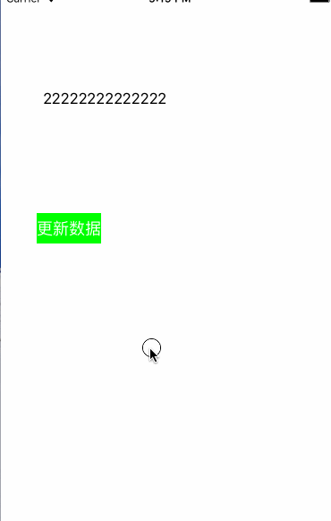

# SLQScrollView
滚动条，可点击



- 使用方法
- 1、包含头文件 
  - #import "SLQScrollView.h"
- 2、初始化控件
  
```objc
    SLQScrollView *scrollView = [[SLQScrollView alloc] initWithFrame:CGRectMake(0, 100, 200, 44)];
    scrollView.delegate = self;
    scrollView.margin = 10;
    scrollView.titleArray = @[@"哈哈哈哈哈哈哈啊哈哈",
                              @"laladhfakjdhfn啊到时罚款交",
                              @"hahhahakdhfkhroijewoi"];
    [self.view addSubview:scrollView];
    self.scrollView = scrollView;
```
- 3、实现代理方法

```objc
- (void)scrollView:(SLQScrollView *)scrollView didClickItemWithIndex:(NSInteger)index
{
    NSLog(@"i am the %zd item",index);
    UIAlertView *alert = [[UIAlertView alloc] initWithTitle:[NSString stringWithFormat:@"俺是控件%zd",index] message:@"哈哈哈" delegate:nil cancelButtonTitle:@"取消" otherButtonTitles:nil, nil];
    [alert show];
}
```
- 4、如果要更新数据，可以使用如下方法

```objc
- (void)updateData
{
    [self.scrollView  reloadDataWithArray:@[@"11111111111111",@"22222222222222",@"33333333333333",@"4444444444444444"]];
}
```

- 5、一定要手动移除定时器,以保证定时器被销毁

```objc
- (void)dealloc
{
    [self.scrollView removeAllTimers];
}
```
